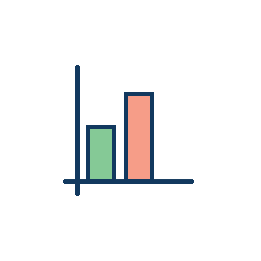

<pre align="center">
<strong>Ali Eren Ekinci /</strong> <a href="https://www.alierenekinci.com">Homepage</a> / <a href="https://twitter.com/aliereneknci">Twitter</a> / <a href="https://github.com/alierenekinci">GitHub</a> / <a href="https://www.kaggle.com/alierenekinci">Kaggle</a></pre>

## Scripting & Programming Language Skills

* Python, R
* SQL
* C & C++
* Qt
* Git
* Html, Css, Php
* Swift
* .. .

  

## My 2021 Goals

### Python
- [x] OOP in Python
- [x] Numpy
- [x] Scipy
- [x] Matplotlib
- [x] Seaborn
- [x] Pandas

### C++
- [x] Qt
- [x] OpenMp Lib.
- [x] thread Lib.
- [x] pthread Lib.

## My 2022 Goals
### Python
- [2/10] Sklearn
- [ ] Open Cv
- [ ] .. .

[www.alierenekinci.com](https://www.alierenekinci.com) / [alierenekinci.github.io](https://alierenekinci.github.io)

